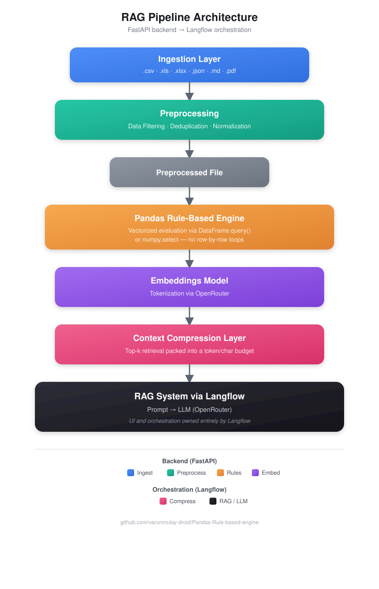

<div align="center">

# 🧩 Pandas Rule-Based Engine — RAG Pipeline Backend

**A vectorized, industry-grade rules engine feeding a Retrieval-Augmented Generation pipeline — served through Langflow.**

[](https://www.python.org/)
[](https://fastapi.tiangolo.com/)
[](https://pandas.pydata.org/)
[](https://www.langflow.org/)
[](https://openrouter.ai/)
[](#license)

</div>

---

## 📐 Architecture

<div align="center">
  
</div>

> **The UI is strictly Langflow.** This repository is the *engine room* — ingestion, cleaning, rule evaluation, embeddings, and context compression all happen here, behind a FastAPI backend. Langflow owns the retrieval-augmented prompt → LLM flow and the chat surface on top of it.

---

## ✨ Highlights

| | |
|---|---|
| ⚡ **Vectorized rules** | No `iterrows()`. Every rule runs via `DataFrame.query()` or `numpy.select` across the full dataset in one pass. |
| 🛡️ **Validated by design** | Rules are schema-checked, deduplicated by name, and cross-referenced against real DataFrame columns before execution — bad rules fail fast, not silently at row 40,000. |
| 🔀 **Two execution backends** | `query` for flexible, possibly-overlapping conditions. `np_select` for maximum throughput on mutually exclusive rules. |
| 🧠 **Bring your own models** | API key, embedding model, and LLM model are supplied at runtime — nothing is hardcoded. |
| 📄 **Multi-format ingestion** | CSV, Excel, JSON, Markdown, and PDF all normalize into the same tabular shape. |
| 🧵 **Context-aware compression** | Cosine-similarity top-k retrieval packed into a hard character budget before it ever reaches the LLM. |

---

## 🗂️ Project Layout

```
rag_pipeline/
├── app/
│   ├── loaders.py               # Ingestion — multi-format file readers
│   ├── preprocessing.py         # Filtering, exact + near-duplicate dedup, normalization
│   ├── rule_engine.py           # ⭐ Vectorized rule engine (query & np.select backends)
│   ├── openrouter_clients.py    # Embeddings + Chat clients for OpenRouter
│   ├── compression.py           # Top-k retrieval + context-budget compression
│   ├── static/index.html        # 🖥️ Self-contained dashboard UI (served at "/")
│   └── main.py                  # FastAPI app wiring the full pipeline
├── langflow_custom/
│   ├── rag_backend_component.py # Langflow custom component (drop into custom_components/)
│   └── rag_pipeline_flow.json   # Importable Langflow flow (component code embedded — no file copy needed)
├── requirements.txt
└── README.md
```

---

## 🖥️ Using the dashboard (no external tools needed)

Once deployed (or running locally), just open the service's root URL in a browser:

```
https://<your-service>.onrender.com/
```

This serves a self-contained page where you can, in order:

1. **Configure** — optionally override the embedding/LLM API keys and models (pre-filled from env vars if set).
2. **Ingest** — upload a `.csv` / `.xls(x)` / `.json` / `.md` / `.pdf` file.
3. **Preprocess** — filter and/or dedup rows.
4. **Apply rules** — paste a JSON rule list, pick `query` or `np_select`, run it.
5. **Embed** — generate embeddings for the ingested data.
6. **Ask** — type a question, get a retrieved-and-compressed-context answer straight from the base LLM.

Everything on this page calls the same REST endpoints documented at `/docs` — the dashboard is just a UI layer on top, no separate deployment required.

---

## 🚀 Quickstart

```bash
git clone https://github.com/varunmulay-droid/Pandas-Rule-based-engine.git
cd Pandas-Rule-based-engine
pip install -r requirements.txt
uvicorn app.main:app --reload --port 8000
```

The API is now live at `http://localhost:8000` (interactive docs at `/docs`).

### Configuring credentials

Config is resolved with this precedence:

1. `POST /config` — overrides everything at runtime, no redeploy needed.
2. Environment variables — read once at startup:
   - `EMBEDDING_API_KEY` / `EMBEDDING_MODEL`
   - `LLM_API_KEY` / `LLM_MODEL`

Embeddings and the base LLM use **separate** keys and model names, since they may
come from different OpenRouter accounts. If neither source is set, credential-requiring
endpoints return a `400` listing exactly what's missing. `GET /config/status` reports
whether each is configured without ever revealing the keys themselves.

---

## ☁️ Deploying on Render

This repo includes a `render.yaml` Blueprint at the root, pinned to Python 3.11 (Render's
default Python 3.14 currently breaks pip's dependency resolver on some packages).

1. On [Render](https://dashboard.render.com) → **New** → **Blueprint** → select this repo.
2. Render detects `render.yaml` and prompts you to fill in four environment variables
   (`sync: false` means you type them in at deploy time — they're never committed to the repo):
   - `EMBEDDING_API_KEY`
   - `EMBEDDING_MODEL` (e.g. `liquid/lfm-2.5-embedding-350m:free`)
   - `LLM_API_KEY`
   - `LLM_MODEL` (e.g. `nvidia/nemotron-3.5-content-safety:free`)
3. Click **Apply** — Render runs `pip install -r requirements.txt` then `uvicorn app.main:app --host 0.0.0.0 --port $PORT`.
4. Once live, verify with `curl https://<your-service>.onrender.com/health` and `.../config/status`.

> Free-tier services spin down after ~15 min idle; the in-memory pipeline state (`_STATE.records`/`embeddings`)
> resets on every restart (config re-seeds from env vars automatically), so re-run
> `/ingest` → `/preprocess` → `/apply-rules` → `/embed` after a cold start.

---

## 🔧 Pipeline API

| Step | Endpoint | Purpose |
|---|---|---|
| 0 | `POST /config` (optional) | Override the env-var-sourced embedding/LLM API keys + model names at runtime |
| 1 | `POST /ingest` | Upload a file (`.csv` / `.xls(x)` / `.json` / `.md` / `.pdf`) |
| 2 | `POST /preprocess` | Filter, dedup, normalize the ingested data |
| 3 | `POST /apply-rules` | Run the rule engine over the preprocessed data |
| 4 | `POST /embed` | Generate embeddings for downstream retrieval |
| 5 | `POST /query` | Retrieve + compress top-k context for a question |
| 6 | `POST /generate` | End-to-end retrieve → compress → LLM call (for testing outside Langflow) |

<details>
<summary><strong>Example: configuring your models</strong></summary>

```bash
curl -X POST http://localhost:8000/config \
  -H "Content-Type: application/json" \
  -d '{
        "embedding_api_key": "sk-or-...",
        "embedding_model": "liquid/lfm-2.5-embedding-350m:free",
        "llm_api_key": "sk-or-...",
        "llm_model": "nvidia/nemotron-3.5-content-safety:free"
      }'
```
</details>

<details>
<summary><strong>Example: defining rules</strong></summary>

```json
{
  "rules": [
    { "name": "example_rule", "condition": "some_column > 10", "action": "Flag" }
  ],
  "strategy": "last_match",
  "backend": "query"
}
```

- `condition` — any valid `DataFrame.query()` expression.
- `strategy` — `first_match` or `last_match` (which rule wins when several match the same row).
- `backend` — `query` (flexible) or `np_select` (fastest, mutually-exclusive rules).

Every rule is validated before it runs, and every match is logged with the row count it affected.
</details>

---

## 🔗 Wiring the Langflow Flow (optional)

The dashboard above is enough on its own — Langflow is only needed if you specifically want the chat orchestrated inside Langflow's own canvas.

**Fastest way — import the ready-made flow:**

1. Open Langflow → **Import** → select [`langflow_custom/rag_pipeline_flow.json`](langflow_custom/rag_pipeline_flow.json) from this repo.
2. The flow imports fully wired: `Chat Input → RAG Backend Bridge → Prompt → OpenRouter LLM → Chat Output`. The bridge component's code is embedded directly inside the JSON, so nothing needs to be copied into `custom_components/`.
3. Open the **RAG Backend Bridge** node and set `Backend URL` to your deployed service's `/query` endpoint (defaults to the Render URL used during development).
4. Open the **OpenRouter LLM** node and set your API key + `model_name` to match `LLM_MODEL` on the backend.
5. Run the flow.

**Manual alternative:** copy `langflow_custom/rag_backend_component.py` into your Langflow `custom_components/` directory, restart Langflow, and build the same four-node flow by hand.

Everything upstream of the prompt — ingestion, preprocessing, rules, embeddings, compression — already happened in the FastAPI backend (via the dashboard or `/docs`). Langflow's job, if you use it, is purely the final retrieval-augmented generation step and its own chat UI.

---

## 🧱 Design Principles

- **Fail loud, not silent.** Malformed rules, unknown columns, and duplicate rule names are caught before execution.
- **No hidden state in models.** API keys and model identifiers travel with the request/config call — never baked into code.
- **Vectorization first.** Anything that touches every row is written to run in one pass over the DataFrame or NumPy array.
- **Separation of concerns.** The backend never renders UI; Langflow never touches raw data cleaning or rule logic.

---

## 📜 License

MIT — see [LICENSE](LICENSE) for details.

---

<div align="center">
<sub>Built by <a href="https://github.com/varunmulay-droid">@varunmulay-droid</a></sub>
</div>
